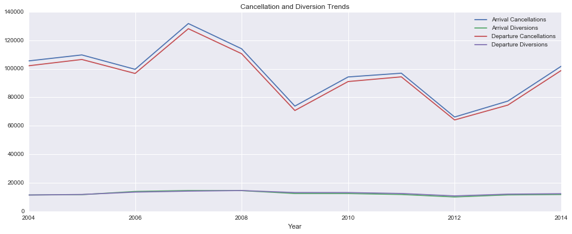
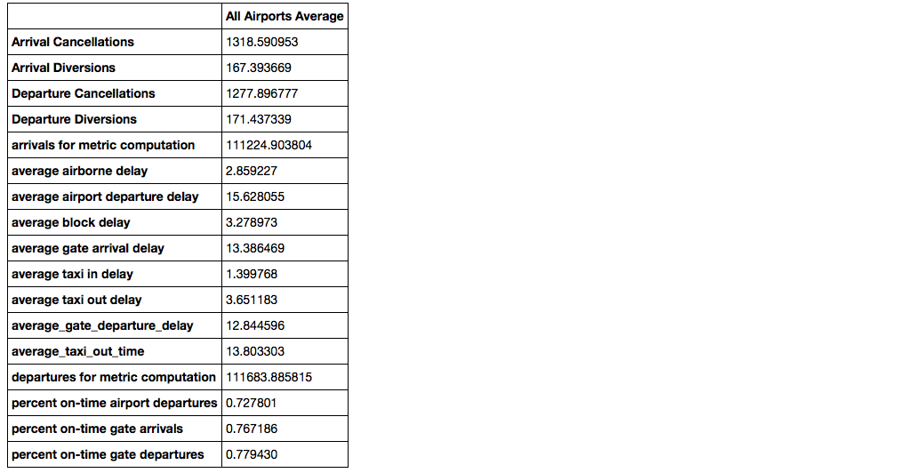
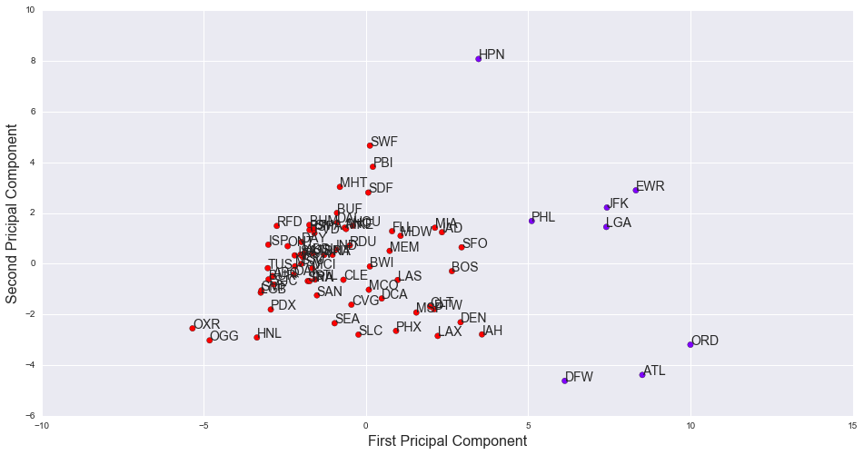
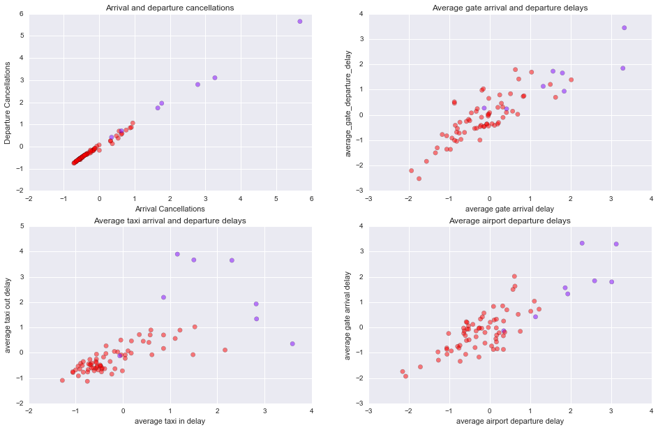
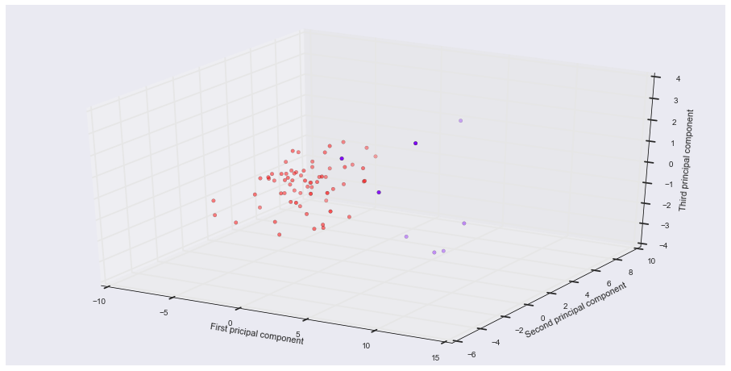
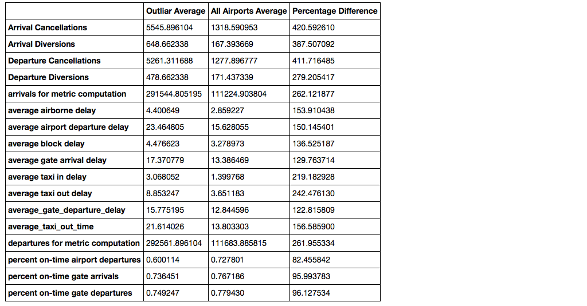

# Airport Delays - Clustering to Determine Problem Airports

## Summary

### Aim

This project looks at operations data of major airports around the USA, in particular the delays around departure and arrivals. The aim is to be able to understand the operational characteristics with the goal of decreasing delays at targeted airports.

To do this we will start with some initial exploratory analysis to understand the data, then deploy clustering techniques in order to determine which airports need targeting. Once we have these airports we can then further investigate their characteristics in order to make reccomendations on decreasing delays.

### Data

The analysis uses three different datasets related to airport operations over a 10 year period; A dataset detailing the arrival and departure delays/diversions by airport, a dataset that provides metrics related to arrivals and departures for each airport, and a dataset that details names and characteristics for each airport code.

When loading the data a number of airports were dropped where data was unavailable, leaving a total of 74. This may give an incomplete picture of delays across the USA.

### Analysis

**Trends**

The following graph shows the trends in cancellations and diversions over a 10 year period for the USA as a whole.

As can be seen, the total number of arrival and deperature diversions have remained relatively constant over the 10 year period. Cancellations peaked in 2007 before falling to the lowest levels in 2012. From 2012 a steady increase has been seen.

**Key Statistics**

### Clustering

**Principal Components Analysis**

When checking for relationships in the data, it was found that the majority of features were highly correlated. For this reason, before modelling we conducted Principal Component Analysis (PCA). Principal component analysis is a statistical procedure that converts a set of observations, of possibly correlated variables, into a set of values of linearly uncorrelated variables called principal components. 

Conducting PCA, it was shown that 88% of the variablilty in the data could be described by using just three principal components.

Before deciding on the final clustering technique a number of methods were used including Hierachical Clustering and KMeans. The method chosen for this task was DBSCAN which performed well when identifying outliars from clusters.

**DBSCAN Clustering**

Density-based spatial clustering is a density-based clustering algorithm: given a set of points in some space, it groups together points that are closely packed together (points with many nearby neighbors), marking as outliers points that lie alone in low-density regions.

The following scatter plots show the results of DBSCAN. Outliars are indicated by the purple markers.

The principal component scatter identifies 8 airports as potential outliars. This is mirrored using the same classification labels plotted on varying pairs of features. 

The following 3D plot allows us to visualise all three principal components.

**Outliar Analysis**

**Recommendations**

The following airports were identified as outliars when comparing delay characteristcs across all aiports.

PHL, JFK, EWR, LGA, DFW, ATL, HPN and ORD

Looking at the outliar analysis, these airports show a considerable difference in the averega taxi delay time when compared to all airports as a whole. The average taxi in / out delay is over double the time. Another thing to consider is the average airborn departure and arrival delay, both 50% higher than the average across all airports.

The number of cancellations and diversions also show a large difference, although this could be due to the size of the airports and the number of flights they have arriving and leaving. 