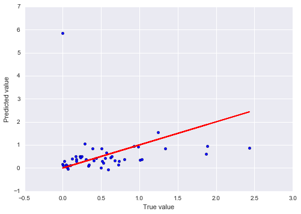
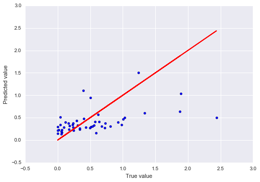
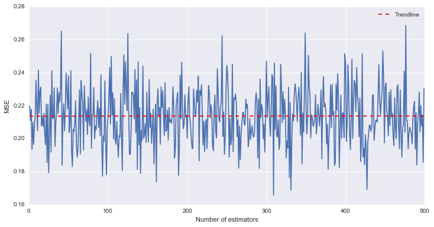

## Progress Report

### Data Exploration Summary

The total amount of forest lost globally in 2014 was 17,309,110 Ha. High rates of deforestation can be seen in large parts of South East Asia and across the African continent, in particular Madigascar. The average loss of forest was 0.37% of the total canopy cover for the year 2000. The highest rate of deforestation was in Portugal, although research has shown this could be due to the large amount of forest fires in recent year.

Features which show high correlations with forest loss are percentage of GDP comprised of the forestry sector, and the amount of forest classed as primary. This says that countries with high forest loss tend to have a high percentage of forestry sector GDP and countries with high forest loss tend to have a low percentage of primary forest. Another interesting relationship was between the Food production index of a country - Countries with a larger food production index also tended to have a larger rate of forest loss.

Correlations can also be seen between GDP per capita and the percentage of certified forest - Countries with a high GDP tend to have a large proportion of certified forests. 

When looking at forest loss compared to membership of conventions, countries part of Nibi had the lowest average rate, while countries part of Itta had the highest. The only convention which showed a decrease in forest loss for membership is ILO-69.   

By clustering it was found that a number countries were identified as outliars when looking across the different features. Outliars may have a negative influence on the accuracy of the model so including clustering as part of the EDA will give us a better understanding in the models limitations. Countries identified as outliars included Russia, Luxemburg, Brazil and the USA, all of which either had a large number of people employed by the forestry sector or a high GDP per capita.

### Modelling Summary

After imputing and scaling the feature set, the first model fitted to the data was linear regression. If the feature space was to have a linear relationship with the target, then we would expect this model to produce reasonable results.

The accuracy of the model was evaluated using the mean squared error, produced by the model predicting on an unseen test set. Using the entire feature set, Linear Regression produced a mean squared error of 0.91. Although we do not have anything to compare this model against, the high test MSE could have been produced by over-fitting.

Plot of predicted and actual test set

One way to deal with over-fitting data when dealing with Linear Regression is to reduce the dimentionality of the feature set. This was done using Sklearn's SelectKBest features. SelectKBest selects the k best features based on the f_regression score. It was shown that the smallest MSE was produced when using the 9 'best' features. These features, in order of importance, included the percentage of economy the forestry sector contributes, Food production index, CITES and percentage of certified forest. These results mirror what was seen in the EDA.

The MSE score produced using this reduced feature set was 0.22, so performed a lot better on unseen data than using the entire feature space.

Plot of predicted and actual test set

Another model which performed well on the data set was Random Forests. A number of Regressor models were used intermediately but did not out-perform Linear Regression. Random Forests is an ensemble method which tries to combine the predictive power of multiple estimators to improve the generalisation over a single estimator.

The MSE produced by Random Forests was 0.17, using a total of 307 estimators. While the MSE score was low, the computational time taken to fit a large number of estimators was costly. In general as the number of trees increases, the MSE improves. The improvement generally decreases as the number of trees increases, but at a certian point the computational cost in learning trees will out-weigh the benfit in model performance.

Another way in which model performance could be increased is to use an ensemble of differnent Regressor models to capture the variations produced by each estimator. While Sklearn does not have an inbuilt function to do this with regressors, linear regression could be used to weight and combine multiple estimators into an ensemble.

Without tuning this model a test MSE of 0.18 was achieved. The next steps will be to tune this ensemble to decrease the MSE score further. The first step in tuning will be to tune each model individually before creating an ensemble. If the models used in the ensemble produce similar results to each other, they will have a high colinearity and will probabaly not improve model accuracy. One way to test for colinearity would to apply Lasso Regression instead of Linear Regression when creating the ensemble. Coefficients of models with a high colinearity will be reduced to zero.