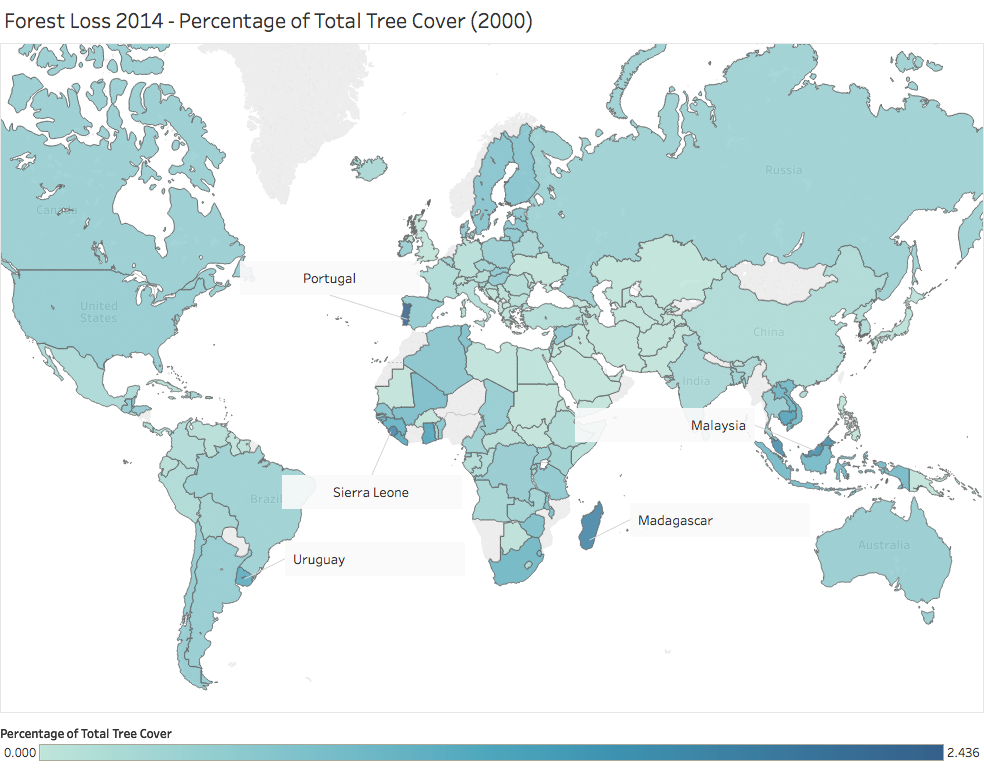
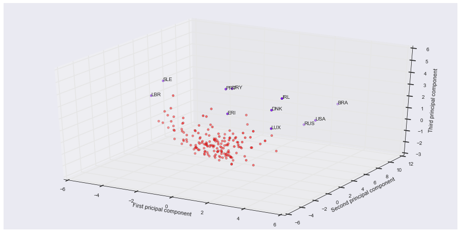
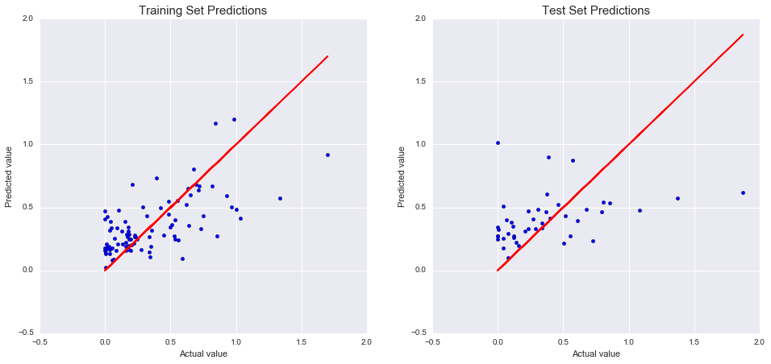
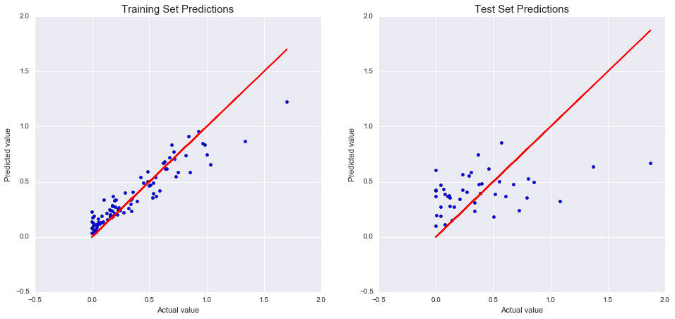
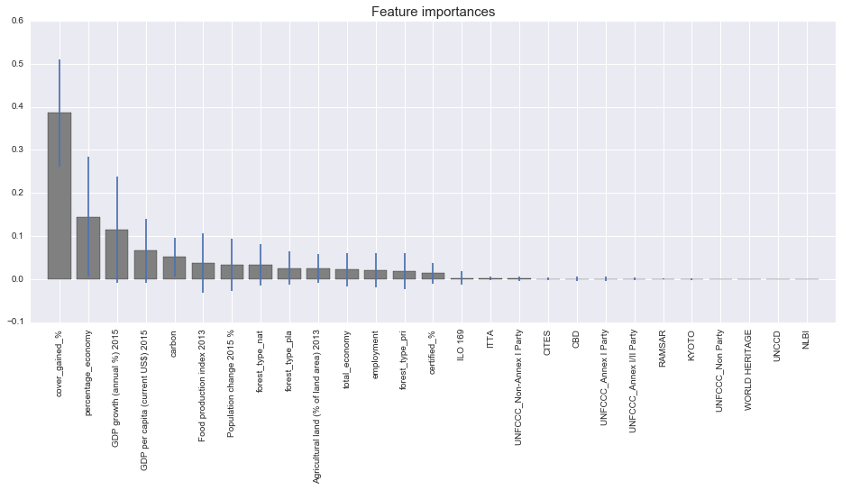
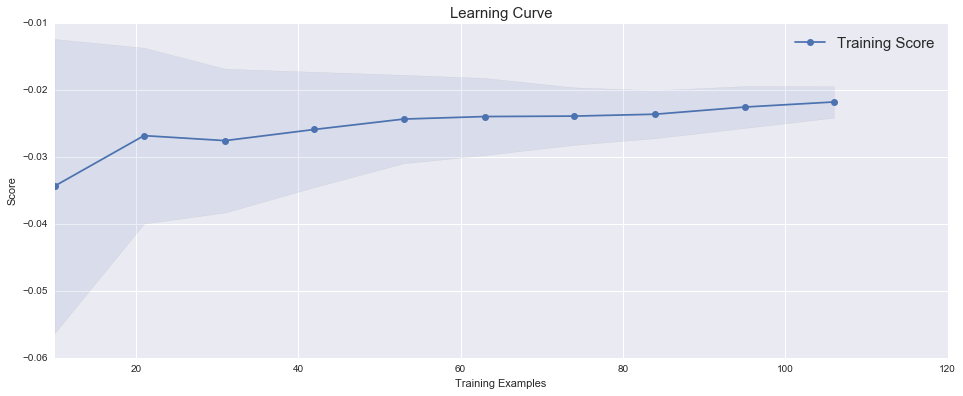

# Project Summary

#### Introduction

The aim of the project is to determine social, economic and environmental features which are potential predictors of the rate in which trees / forests are being destroyed. These predictors can then be used as a tool to either manage the problem, or as an aid to predict changes in canopy cover.

The majority of the data being used for this project has been taken from Global Forest Watch. Global Forest Watch is an open source data repositary whose purpose is to empower people everywhere to better manage and conserve forest landscapes. In addition to this, economic data has also been taken from The World Data Bank, using both data sets in conjunction in order to try and biuld a more complete picture of factors which might contribute to canopy change.

#### Exploratory Data Analysis

The total amount of forest lost globally in 2014 was 17,309,110 Ha, an average loss of 0.37% of the total canopy cover per country. The highest rates of deforestation can be seen in large parts of South East Asia and across the African continent, in particular Malasia, Madigascar and Sierra Leone. The highest rate of deforestation was seen in Portugal, although research has shown this could be due to the large amount of forest fires in recent years.

Forest loss looks to follow a Pareto distribution. The Pareto distribution is a skewed, heavy-tailed distribution that is sometimes used to model the distribution of incomes and other financial variables. The majority of countries fall between one standard deviation either side of the mean, with the largest group having a loss rate between 0.0% - 0.1%.

Features that show a strong, positive correlation with forest loss are food production index, percentage of certified forest, percentage of the economy comprised of the forestry sector and the amount of greenhouse gas emissions produced as a result of land use change and the forestry sector. This says that countries with a high rate of forest loss tend to have a high rate of these features. A features which shows a strong negative correlation with forest loss is the proportion of primary forest cover. Countries with high rates of forest loss tend to have a smaller proportion of primary forest. This could indicate that it is mainly primary forests which are being lost as a result of deforestation.

When looking at forest loss compared to membership of conventions, countries part of Nibi had the lowest average rate, while countries part of Itta had the highest. The only convention which showed a decrease in forest loss for membership is ILO-69.   

Using clustering, it was found that a number countries were identified as outliers. When fitting a model to the data, outliers may have a negative influence on its performance, especilly regressors which are sensitive to noise such as Linear Regression. 

Countries indentified as outliers, averagely have higher rates of forest loss, along with (not limited to) GDP per capita, percentage of agricultural land, percentage of forest cover gained and the percentage of certified forest. Population change and GDP growth rates are averagely less. 

#### Modelling

The best performing linear model was using Linear Regression. Linear Regression seeks to find a linear relationship between the feature space and the target variable. The model was optimised using feature selection, reducing the dimentionality of the data, resulting in a model which generlised well. Feature selection was conducted using SelectKBest, which selects the K best features based on the f_regression score between the feature and the target. The optimal number of features found using this method was nine. Once the model was fitted to the reduced feature set, the top predictors of forest loss, indicated by the model coefficients, were found to be the percentage of the economy comprised of the forestry sector, the percentage of forest certified, food production index and membership of ILO 169 respectively.

Further improvement to the model was made by excluding outlier countries, reducing the MSE score by almost half. Once excluding the outliers, and again conducting feature selection, the optimal number of features selected was four, further reducing the dimentionality of the data. The top predictors selected were the percentage of forest cover gained, the percentage of the economy comprised of the forestry sector, food production index and population change. 

The following plot shows the performance of the model on the training set, used to build the model, and on the test set, unseen data used to judge the model's performance. The mean squared error produced on the test set was 0.136, outperforming the baseline MSE of 0.299 

The best performing model overall was found using Random Forests. Random Forests are an ensemble method, comprising of collections of trees produced on samples of the features space. Random Forests do not expect linear features, or features that interact linearly with the target variable. Another advantage of this method is that because it is an ensemble method it often generalises better than a single estimator such as Linear Regression.

The following plot provides a good visualisation as to why I chose to use ensemble methods. The plot was produced for Adaboosting but the same comparisons can be made for Random Forests. The plot shows that the ensemble method quickly out-performs its simple model counterpart after only the first few estimators.

The un-optimised model was first tuned by increasing the number of estimators. In general, the more trees used, the better the model performed. The improvement decreased as the number of trees increased, and so the computational cost in learning trees out-weighed the benfit in model performance. The model was optimised using Gridsearch with cross validation. It was found that the optimal number of estimators was 50, resulting in a reasonably fast computation time.

Like Linear Regression, the model was further improved by removing the outliers. With the outliers removed the models performance increased, reducing the mean squared error from 0.201 to 0.128. With the removal of outliers, the optimal number of estimators in the ensemble increased to 90, as a result marginally increasing the computational time to learn the trees. The features with the largest impact on the model are the percentage of canopy cover gained, percentage of the economy comprised of the forestry sector, GDP growth rate and GDP per capita respectively. These features do not differ significantly to the linear models and were all shown to have a strong correlation to forest loss in the EDA.

In a production environment it is often the case that the mean squared error produced on a train test split is not a good enough measure of the model's future performance. This is due to the inherent biases in the modelling process.

When bias is introduced into a model, model performance if often over-estimated. Training bias was eliminated by implementing a train test split, producing metrics on the test set. But bias can also be introduced when selecting between different models, known as selection bias. Selection bias is when the data favours one model over the others by chance. For Random Forests this bias was introduced when optimising the model using Gridsearch. To reduce this bias, nested cross validation was used. This gave an unbiased estimator of the model's future performance of 0.16.

Once finding the model's future performance a learning curve of the training error was plotted in order to determine if the model could be fitted on the entire dataset, without biasing its performance.

Because the curve was monotonically increasing, showing that the larger the training set the better the model's performance, the model could be fitted to the entire dataset, with the nested cross-validated score the lower bound of model performance.

